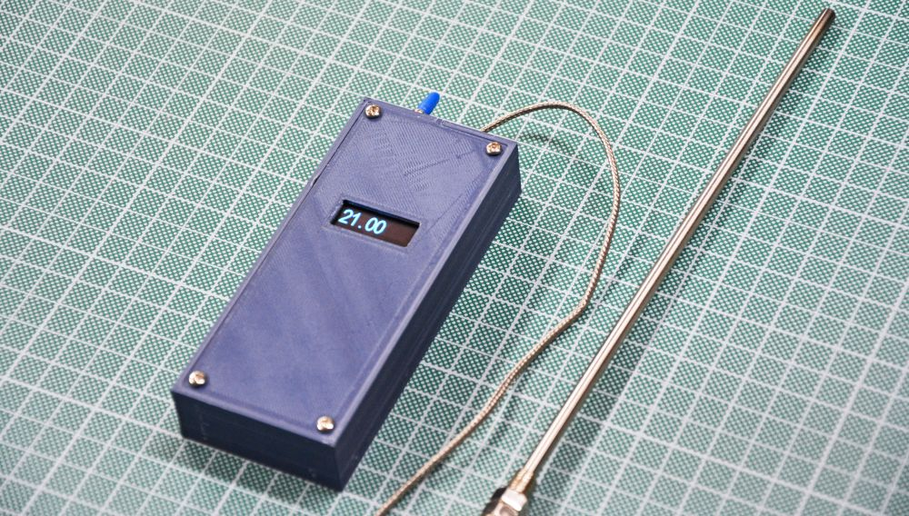

## Handheld Thermocouple Thermometer

This is a project for making an Handheld Thermometer using a K-type Thermocouple. You can read from 0°C up to 1023.75°C depending on the used thermocouple (most thermocouple reads from 0 t 400°C). You cannot read negative temperatures.

Microcontroller used is an ATtiny85 on the Digistump Digispark. Thermocouple is connected through a MAX6675 amplifier. Readings are showed on a 0.91" (128x32) OLED display. Whole thing is powered using a 9V battery connected on Vin pin of the Digispark. Digispark has a 5V regulator on board and a 5V output used for powering the amplifier and the oled. 

>Even if the OLED controller works at 3.3V is safe powering the display at 5V. Those OLEDS have a voltage regulator on board that step down to 3.3V. SDA and SCL lines are connected on display to 3.3V through pull-up resistors: remember that I2C pulls only lines to GND and when an high logic level must be sent, device put the gpio in high impedance so the logic level is given by the pullup resistor.

### Considerations

A thermocouple is made for reading high temperatures in critical ambients, so if you need accurate and precise readings, maybe a thermocouple is not good for you and you should consider using a PT100 instead coupled to a MAX31865 or similar

### Programming the Digispark

I wrote a tutorial [here](https://www.settorezero.com/wordpress/dispositivi-usb-sulla-punta-di-un-dito-il-digispark/). After you prepared the Arduino IDE for programming the Digispark, you must install those 3 libraries:

- TinyWireM by Adafruit
- Tiny4kOLED by Stephen Denne (datacute)
- MAX6675 by Adafruit

### Connections

There is an [hand-drawn schematic](./docs/schematic.jpg) in the docs folder. Anyway here are the connections:

- 9V Battery : (+) => Digispark Vin, (-) => GND
- MAX6675 to Digispark: SCK=>D4, CS=>D3, SO=>D1, VCC=>5V
- 0.91" OLED to Digispark: SCL=>D2, SDA=>D0, VCC=>5V

Thermocouple has a positive (red) and negative (blue) wire: connect them properly.

Put a Switch on a lead of the battery for turning the thermometer on/off.

### Enclosure

I've designed an enclosure for the thermometer: you can find STL and STEP files in the [cad folder](./cad).
Enclosure is [made of 3 parts](./media/enclosure_1.jpg).

Every electronic component has his own slot in the enclosure and lever switch goes through the frontal hole. Thermocouple amplifier, Digispark and Battery with his clip will go in the box (bigger part). OLED display will go under the lid. [See this picture](./media/enclosure_2.jpg).

Thermocouple cable will pass through the frontal slot so you absolutely must not cut the terminals. The small 3D-printed piece [will fit the slot closing it](./media/enclosure_3.jpg).

### Materials
Thermometer Components are [showed here](./media/parts.jpg).

Following links are sponsored and only valid for Italian users, anyway you can use them for reference.

- [Digispark](https://amzn.to/3jfEXZZ) - Warning: maybe is not the original one, so take this link only for reference
- [MAX6675 Breakout Board](https://amzn.to/3iQSKG3)
- [K Thermocouple (2m cable, long probe, max 400°C)](https://amzn.to/2YKbEHv)
- [Oled Display 0.91" 128x32](https://amzn.to/3BI8nak)
- [Lever Switch](https://amzn.to/30f1Q8V)
- [9V Battery](https://amzn.to/3FQUnxt)
- [9V clip](https://amzn.to/3oSUQsM)
- [M3 Inserts](https://amzn.to/3iU5vQ2) (you need only 4)
- [M3 Screws kit](https://amzn.to/2YIq7nI) (you need only 4)

### Links
- [Hackaday.io](https://hackaday.io/project/182165-handheld-thermocouple-thermometer)
- [Hackster](https://www.hackster.io/CyB3rn0id/handheld-thermocouple-thermometer-121893)